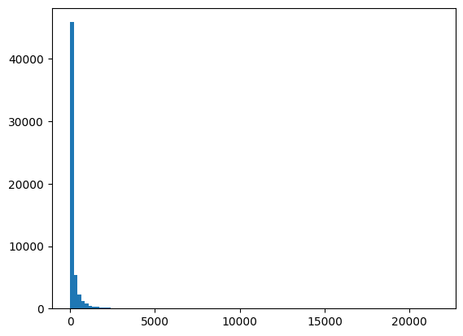

# Implementing an LLM Text Generator on the Persian Wikipedia Dataset

---

## Abstract
This work presents the implementation of a Large Language Model (LLM) for **Persian text generation**, trained entirely from scratch on the **Persian Wikipedia dataset**. Unlike approaches relying on pre-trained models or fine-tuning, this study builds the architecture and training pipeline from the ground up. The dataset is normalized and tokenized using the Hazm library, processed into fixed-length sequences, and used to train a **decoder-only transformer** with sinusoidal positional encoding and masked self-attention. The evaluation employs **Perplexity** and **ROUGE** metrics. Due to limited hardware resources, training was constrained to a subset of the dataset, resulting in partially coherent but repetitive generations. This highlights both the feasibility of such implementations and the importance of computational resources in large-scale text modeling.

---

## 1. Introduction
Large Language Models (LLMs) have shown significant success in natural language processing tasks such as machine translation, summarization, and text generation. Most state-of-the-art systems leverage massive pre-trained models, yet training from scratch on specific datasets provides valuable insights into the underlying mechanisms and challenges.

This study aims to develop a **decoder-only transformer model** trained from scratch on the **Persian Wikipedia dataset**. By avoiding pre-trained weights, we can assess the baseline performance and computational requirements of LLMs in low-resource scenarios.

---

## 2. Dataset Preparation
The dataset used is the **Persian Wikipedia dump** available on Kaggle, split into 10 parts. Due to hardware limitations, only **part 3** was used for training.

### Preprocessing Steps:
1. **Article Extraction:** Extracted articles using the keyword `"عنوان مقاله"`.  
2. **Normalization:** Applied Hazm’s normalizer.  
3. **Special Tokens:** Added `<SOS>` and `<EOS>` tokens to each article.  
4. **Tokenization:** Applied Hazm word tokenizer with options to replace numbers, links, and emails.  
5. **Filtering:** Articles longer than **512 tokens (SEQ_LEN)** were removed (only 9.44% exceeded this length).  
6. **Padding:** Remaining articles were padded to uniform length.  
7. **Vocabulary:** Created `word2id` and `id2word` dictionaries. Rare words (frequency < 5) were replaced with `<UNK>`.

### Article Length Distribution
Below is the histogram of article lengths before filtering:

<div align="center">



</div>
---

## 3. Model Implementation
The model follows a **decoder-only transformer** architecture:

- **Word Embedding Layer**  
- **Sinusoidal Positional Encoding** (fixed, precomputed with sine/cosine functions)  
- **Masked Self-Attention** (causal mask prevents leakage of future tokens)  
- **Residual Connections**  
- **Fully Connected Layer** projecting hidden states to vocabulary size  

### Core Components:
- **PositionEncoding**: Adds positional information to embeddings.  
- **MaskedSelfAttention**: Implements scaled dot-product self-attention with causal masking.  
- **DecoderOnlyTransformer**: Combines embeddings, positional encoding, masked attention, and output layer.  

The model is trained using **CrossEntropyLoss**, ignoring `<PAD>` tokens.

---

## 4. Training Procedure
- **Optimizer**: AdamW  
- **Learning Rate**: 1e-3  
- **Batch Size**: 32  
- **Sequence Length**: 512  
- **Embedding Dimension (d_model)**: 64  
- **Epochs**: 1 (due to hardware constraints)  

The dataset was split into **80% training / 20% testing**. During each iteration:
1. Input sequences shifted as `(x, y)` pairs.  
2. Model predicted next tokens.  
3. Loss and perplexity were computed and logged.  
4. Parameters updated using backpropagation.  

---

## 5. Evaluation
The model was evaluated using **Perplexity** and **ROUGE**:

- **Perplexity:** ~664,987.31  
- **ROUGE:** Low overlap with ground truth, indicating poor coherence.  

These results confirm that training on limited hardware with small embedding sizes leads to underfitting.

---

## 6. Results
Sample generations from the trained model include repetitive and incoherent sentences:

```

Predicted Tokens:

( زاده NUM 4 ) NUM 4 ) NUM 4 ) بازیگر در گاهشماری هجری قمری ) بازیگر NUM 4 ) ، و در سال NUM 4 میلادی است . این سال NUM 4 میلادی است . جمعیت آن NUM 4 میلادی است . این شهر در سال NUM 4 در سال NUM 4 در سال NUM 4 میلادی است . این سال NUM 4 میلادی است . این سال NUM 2 درصد از NUM 4 در سال NUM 4 در سال NUM 4 میلادی است . این فیلم های NUM 2 درصد از NUM 4 میلادی است . این سال NUM 4 در سال NUM 4 در سال NUM 4 به عنوان NUM 2 میلیون NUM 2 اکتبر NUM 4 میلادی ) و NUM 4 میلادی است . این سال NUM 4 در سال NUM 4 در سال NUM 4 میلادی است . در سال NUM 2 نفر ( NUM 4 در سال NUM 4 تا NUM 4 میلادی است . این سال NUM 4 میلادی است . این سال NUM 2 متر مربع و NUM 4 میلادی ) ، جمعیت آن NUM 4 در سال NUM 4 در سال NUM 2 سالگی در سال NUM 4 میلادی ) و در سال NUM 2 متر در سال NUM 4 در سال NUM 4 میلادی است . این سال NUM 4 در سال NUM 4 در سال NUM 4 به عنوان سال NUM 4 به عنوان NUM 4 به صورت گرفته و NUM 4 به صورت گرفته و NUM 2 سال NUM 2 سالگی NUM 2 اکتبر NUM 4 میلادی است . این سال NUM 4 میلادی است . این سال NUM 4 میلادی است . او در سال NUM 2 نفر ( NUM 4 به عنوان سال NUM 4 به عنوان سال NUM 4 در سال NUM 4 ) ، NUM 4 در سال NUM 4 در سال NUM 4 در سال NUM 4 در سال NUM 4 میلادی است . در سال NUM 2 سالگی در سال NUM 2 درصد از NUM 4 میلادی است . این سال NUM 4 میلادی است . این سال NUM 2 میلیون دلار در سال NUM 2 متر در NUM 2 میلیون دلار در سال NUM 4 میلادی است . این سال NUM 2 متر NUM 2 اکتبر NUM 4 میلادی NUM 4 میلادی NUM 2 سالگی NUM 2 میلیون دلار در NUM 2 میلیون دلار در NUM 4 میلادی است . این سال NUM 4 در NUM 2 درصد های NUM 4 میلادی است . این فیلم در NUM 4 به عنوان NUM 4 میلادی ) ، NUM 2 سالگی در NUM 2 اکتبر NUM 4 ) ، جمعیت آن NUM 4 میلادی است . این سال NUM 4 میلادی است . اول محرم این سال NUM 4 میلادی NUM 4 میلادی است . اول محرم این سال NUM 2 درصد از NUM 2 نفر ( NUM 4 میلادی است . این سال NUM 4 میلادی است . این سال NUM 4 میلادی NUM 2 درصد از NUM 4 میلادی است . این سال NUM 4 میلادی است . این سال NUM

```


The generated outputs show the model learned basic token prediction patterns but failed to capture long-term coherence due to limited training data and hardware.

---

## 7. Discussion
The implementation highlights several challenges:
- **Hardware Constraints:** Training a transformer from scratch is computationally expensive.  
- **Data Efficiency:** Removing long articles reduces resource needs but discards potentially useful information.  
- **Model Capacity:** A small embedding size (64) limits expressiveness compared to typical LLMs (hundreds of dimensions).  

Despite these limitations, the experiment demonstrates the **end-to-end feasibility** of building a Persian text generator from scratch.

---

## 8. Future Work
1. Train on the **full Persian Wikipedia dataset** with multiple epochs.  
2. Increase **model size** (hidden dimensions, number of layers, attention heads).  
3. Apply **pre-training tasks** (e.g., masked language modeling) before fine-tuning.  
4. Use additional **evaluation metrics** such as BLEU and human evaluation for fluency.  
5. Leverage **GPU clusters or TPUs** for large-scale training.  

---

## References
1. Vaswani, A. et al. *Attention Is All You Need*. NeurIPS, 2017.  
2. Hazm: Python library for Persian NLP – https://github.com/sobhe/hazm  
3. TorchMetrics – https://torchmetrics.readthedocs.io  
4. Kaggle Persian Wikipedia Dataset – https://www.kaggle.com  

---
